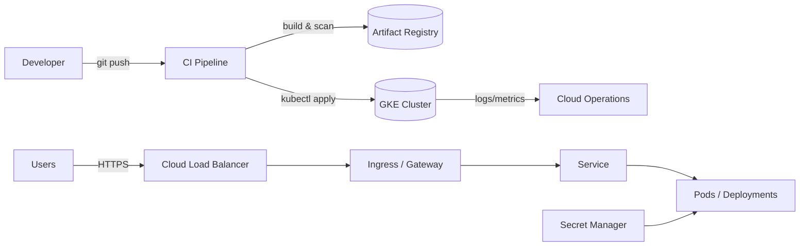

# 🌥️ GCP + GKE Production Blueprint


**Redaction statement:** This repository contains **no secrets, IP addresses, organisation identifiers, or tenant-specific details**. All values are placeholders. Replace them via environment variables, Secret Manager, or your preferred vault solution.

---

## 🔧 Project Summary

A production-ready reference implementation for running containerised workloads on **Google Cloud Platform (GCP)** using **Google Kubernetes Engine (GKE)**, **Artifact Registry**, **Cloud Build / GitHub Actions**, **Secret Manager**, and **Cloud Operations**. It includes a battle-tested folder structure, runbooks, cutover/rollback plans, and security hardening notes — ready to `git init` and push.

### 🎯 Goals
- Repeatable, auditable deployments
- Explicit security boundaries (least-privilege IAM, no long‑lived creds)
- Operational excellence (runbooks, SLOs, health checks)
- Clean repo with zero sensitive data

### 📦 Scope
- Single or multi‑env (e.g., `dev`, `staging`, `prod`)
- Stateless microservice sample (HTTP) with optional ingress
- CI/CD to build, scan, and deploy images to GKE
- Observability via Cloud Logging/Monitoring

---

## 🗂️ Repository Structure

```text
.
├── README.md
├── RUNBOOK.md
├── docs/
│   ├── OVERVIEW.md
│   ├── ARCHITECTURE.md
│   ├── CUTOVER_CHECKLIST.md
│   ├── ROLLBACK.md
│   └── SECURITY.md
├── k8s/
│   ├── namespace.yaml
│   ├── deployment.yaml
│   ├── service.yaml
│   └── ingress.yaml
├── scripts/
│   ├── 00_prereqs.sh
│   ├── 10_create_gke.sh
│   ├── 20_build_and_push.sh
│   ├── 30_deploy_k8s.sh
│   ├── 40_healthcheck.sh
│   ├── 90_destroy_gke.sh
│   └── examples/
│       ├── iam-binding.json
│       └── artifact-registry-lifecycle.json
├── .github/workflows/
│   └── ci.yml
└── .gitignore
```

---

## 🧭 Lifecycle Stages

1. **Discover** → requirements, constraints, SLOs, compliance
2. **Design** → architecture, networking, IAM, cluster baseline
3. **Build** → IaC, Dockerfiles, manifests, CI pipelines
4. **Test** → unit/integration, policy tests, smoke tests
5. **Harden** → Pod Security Standards, network policy, scanning
6. **Deploy** → progressive rollout, canary/blue‑green
7. **Operate** → SRE runbook, on‑call, backup/restore
8. **Observe** → logs, metrics, tracing, error budgets
9. **Improve** → post‑mortems, automation, cost
10. **Decommission** → archive, destroy, revoke access

---

## 🗺️  Flow



---

## 🚀 Quick Start (safe placeholders)

```bash
# Authenticate
gcloud auth login
gcloud config set project <YOUR_PROJECT_ID>
gcloud config set compute/region <YOUR_REGION>
gcloud config set compute/zone <YOUR_ZONE>

# Bootstrap (creates cluster + AR repo if missing)
bash scripts/00_prereqs.sh
bash scripts/10_create_gke.sh

# Build and push demo image, then deploy to GKE
bash scripts/20_build_and_push.sh
bash scripts/30_deploy_k8s.sh

# Verify
bash scripts/40_healthcheck.sh
```

> See **RUNBOOK.md** for full day‑2 operations, **docs/** for architecture, cutover, rollback, and security.

---

## 🧩 Example Use Case (replace with your own)

“GCP-hosted containerised service on GKE with Cloud Build/GitHub Actions, Artifact Registry, and workload‑identity‑bound service accounts. Public ingress via HTTPS, private admin via IAP/VPN.”

---

## ✅ Quality & Safety

- All files are **redacted** and safe to publish.
- Secrets must be provided through **Secret Manager** or your CI secrets store.
- Images are vulnerability‑scanned before deployment.
- Linting and policy checks are run by CI.

---

## 📜 License

Choose an appropriate license for your organisation (e.g., Apache‑2.0). Omitted by default.
