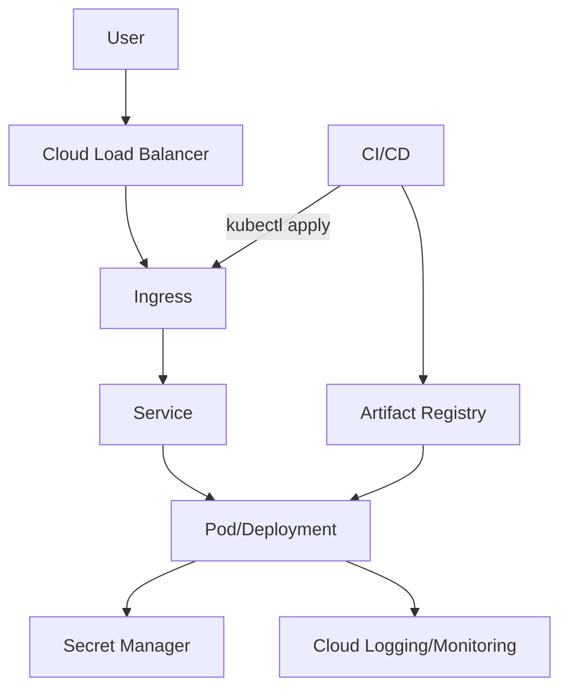

# ARCHITECTURE

- **Network:** Regional GKE, private nodes (optional), authorized networks for control plane
- **Ingress:** Cloud Load Balancer → GKE Ingress/Gateway
- **Registry:** Artifact Registry (scoped to region)
- **Identity:** Workload Identity (no JSON keys)
- **Security:** Pod Security Standards + NetworkPolicy
- **Data:** External managed services (e.g., Cloud SQL) — optional

